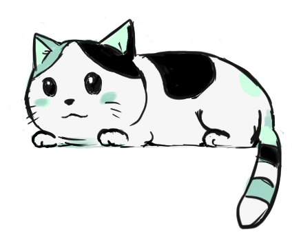

# CATAKU

Calculator App written in JavaScript.

## Overview

- It was quite rough at first trying to get all the functions work seamlessly. So many things to consider but I finally got them working. The app should behave like how a normal Calculator should.
- Full Keyboard support with the following mapping:

  > - **Numbers**: Number keys.
  > - **Equal**: Enter.
  > - **Clear All**: Escape.
  > - **Clear One by One**: Backspace.
  > - **Audio Switch**: Control.

- Mobile support.
- **Logo** and **Image** were made in Clip Studio Paint and Photoshop.

---

I have a Small Art shop. You can view my Art here.

[Gumroad: https://kitsune7x.gumroad.com/](https://kitsune7x.gumroad.com/)

Thank you for visiting.
